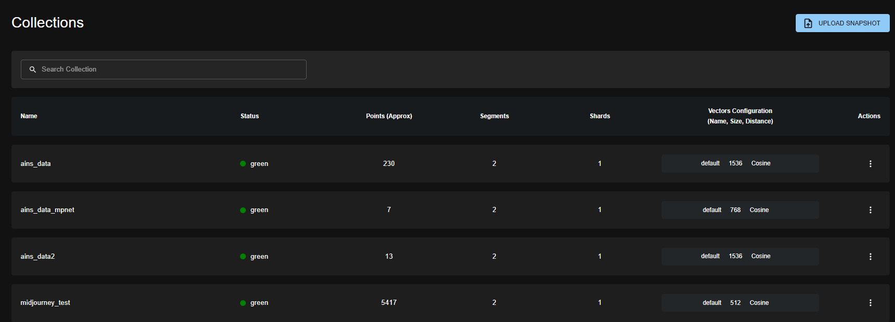

# Qdrant Setup Tutorial: Complete Beginner's Guide

## What is Qdrant?

Qdrant is a vector database designed for storing, searching, and managing vector embeddings. It's perfect for building AI applications that require similarity search, recommendation systems, and semantic search capabilities.

## Key Features

- Fully Open-source
- Self-hosting: You can run Qdrant on your own infrastructure
- Super Fast Latency: Approximately 0.024 seconds (~24ms)
- Hybrid Search
- UI Support
- Free Tier: Offers support for up to 1 million 768-dimensional vectors

## Why Qdrant is Super Fast
- Qdrant achieves its high speed due to several key optimizations:

- Rust-Based Engine: Written in Rust, which is known for its performance and memory safety
- HNSW (Hierarchical Navigable Small World) Indexing: This algorithm enables fast Approximate Nearest Neighbor (ANN) search, efficiently finding the best matches without scanning the entire dataset
- Vector Quantization: This technique is especially useful for large-scale datasets as it significantly saves RAM (up to 16x)
- Batch & Parallel Processing: Qdrant is designed to handle operations in batches and process them in parallel, further enhancing its performance

## Installation Methods

There are two main ways to run Qdrant:
1. **Docker** (Recommended for most users)
2. **Local Python Client** (For Python developers)

---

## Method 1: Docker Installation

### Prerequisites
- Docker installed on your system
- Basic command line knowledge

### Step 1: Pull the Qdrant Docker Image

```bash
docker pull qdrant/qdrant
```

### Step 2: Run Qdrant Container

```bash
docker run -p 6333:6333 -p 6334:6334 \
-v "$(pwd)/qdrant_storage:/qdrant/storage:z" \
qdrant/qdrant
```

**What this command does:**
- `-p 6333:6333`: Exposes REST API port
- `-p 6334:6334`: Exposes gRPC API port  
- `-v "$(pwd)/qdrant_storage:/qdrant/storage:z"`: Creates persistent storage

### Step 3: Verify Installation

Once running, Qdrant is accessible at:

- **REST API**: [http://localhost:6333](http://localhost:6333)
- **Web Dashboard**: [http://localhost:6333/dashboard](http://localhost:6333/dashboard)
- **gRPC API**: [http://localhost:6334](http://localhost:6334)

---

## Method 2: Local Python Installation

### Prerequisites
- Python 3.7+ installed
- pip package manager

### Step 1: Install Qdrant Client

```bash
pip install qdrant-client
```

### Step 2: Use Local Mode

For development and testing, you can use Qdrant's local mode which doesn't require a separate server:

```python
from qdrant_client import QdrantClient

# Create a local Qdrant instance
client = QdrantClient(location=":memory:")  # In-memory storage
# OR
client = QdrantClient(path="./local_qdrant")  # Persistent local storage
```

---

## Getting Started: Your First Qdrant Application

### Step 1: Install Python Client

Even if using Docker, install the Python client for easy interaction:

```bash
pip install qdrant-client
```

### Step 2: Initialize Connection

```python
from qdrant_client import QdrantClient

# For Docker installation
client = QdrantClient(url="http://localhost:6333")

# For local mode
# client = QdrantClient(path="./local_qdrant")
```

### Step 3: Create Your First Collection

```python
from qdrant_client.models import Distance, VectorParams

client.create_collection(
    collection_name="test_collection",
    vectors_config=VectorParams(size=4, distance=Distance.DOT),
)
```

**What this does:**
- Creates a collection named "test_collection"
- Sets vector dimension to 4
- Uses DOT product for similarity calculation


### Step 4: Add Sample Data

```python
from qdrant_client.models import PointStruct

operation_info = client.upsert(
    collection_name="test_collection",
    wait=True,
    points=[
        PointStruct(id=1, vector=[0.05, 0.61, 0.76, 0.74], payload={"city": "Berlin"}),
        PointStruct(id=2, vector=[0.19, 0.81, 0.75, 0.11], payload={"city": "London"}),
        PointStruct(id=3, vector=[0.36, 0.55, 0.47, 0.94], payload={"city": "Moscow"}),
        PointStruct(id=4, vector=[0.18, 0.01, 0.85, 0.80], payload={"city": "New York"}),
        PointStruct(id=5, vector=[0.24, 0.18, 0.22, 0.44], payload={"city": "Beijing"}),
        PointStruct(id=6, vector=[0.35, 0.08, 0.11, 0.44], payload={"city": "Mumbai"}),
    ],
)

print(operation_info)
```

**Expected output:**
```
operation_id=0 status=<UpdateStatus.COMPLETED: 'completed'>
```

### Step 5: Perform Vector Search

```python
search_result = client.query_points(
    collection_name="test_collection",
    query=[0.2, 0.1, 0.9, 0.7],
    with_payload=True,
    limit=3
).points

print(search_result)
```

**Expected output:**
```python
[
    {
        "id": 4,
        "version": 0,
        "score": 1.362,
        "payload": {"city": "New York"},
        "vector": null
    },
    {
        "id": 1,
        "version": 0,
        "score": 1.273,
        "payload": {"city": "Berlin"},
        "vector": null
    },
    {
        "id": 3,
        "version": 0,
        "score": 1.208,
        "payload": {"city": "Moscow"},
        "vector": null
    }
]
```


### Step 6: Add Filtering

```python
from qdrant_client.models import Filter, FieldCondition, MatchValue

search_result = client.query_points(
    collection_name="test_collection",
    query=[0.2, 0.1, 0.9, 0.7],
    query_filter=Filter(
        must=[FieldCondition(key="city", match=MatchValue(value="London"))]
    ),
    with_payload=True,
    limit=3,
).points

print(search_result)
```

**Expected output:**
```python
[
    {
        "id": 2,
        "version": 0,
        "score": 0.871,
        "payload": {"city": "London"},
        "vector": null
    }
]
```

---

## Verification and Testing

### Check Qdrant Status

Visit the web interface at [http://localhost:6333/dashboard](http://localhost:6333/dashboard) to:
- View collections
- Monitor cluster health
- Explore data visually
you can see here a set of created collections: 


### Test REST API

```bash
curl http://localhost:6333/collections
```

This should return JSON with your collections.

---

## Next Steps

1. **Explore Qdrant Cloud**: Try the managed service at [cloud.qdrant.io](https://cloud.qdrant.io)
2. **Read Documentation**: Check out [official tutorials](https://qdrant.tech/documentation/tutorials/)
3. **Join Community**: Connect with other users on [Discord](https://qdrant.to/discord)
4. **Advanced Features**: Learn about clustering, sharding, and optimization

### Useful Resources

- [Official Documentation](https://qdrant.tech/documentation/)
- [Python Client Examples](https://github.com/qdrant/qdrant-client)
- [REST API Reference](https://qdrant.github.io/qdrant/redoc/index.html)
- [Community Examples](https://qdrant.tech/documentation/examples/)
- [Interactive Tutorials](https://88d28cad-e92f-4c46-bb89-5107eda3e405.europe-west3-0.gcp.cloud.qdrant.io:6333/dashboard#/tutorial)
---

## Tutorial Article 
For a detailed step-by-step guide on how to setup Qdrant, read the full tutorial on Medium:
[**Why Qdrant Will Be Your Favorite Vector Database (Setup in 10 Minutes)**](https://medium.com/@mohammedarbinsibi/why-qdrant-will-be-your-favorite-vector-database-setup-in-10-minutes-bc0a79651a14)

## Summary

You've successfully:
✅ Installed Qdrant using Docker or locally  
✅ Created your first collection  
✅ Added vector data with payloads  
✅ Performed similarity search  
✅ Applied filters to search results  

Qdrant is now ready for your vector database applications! Start building recommendation systems, semantic search, or any AI application that needs fast similarity matching.
