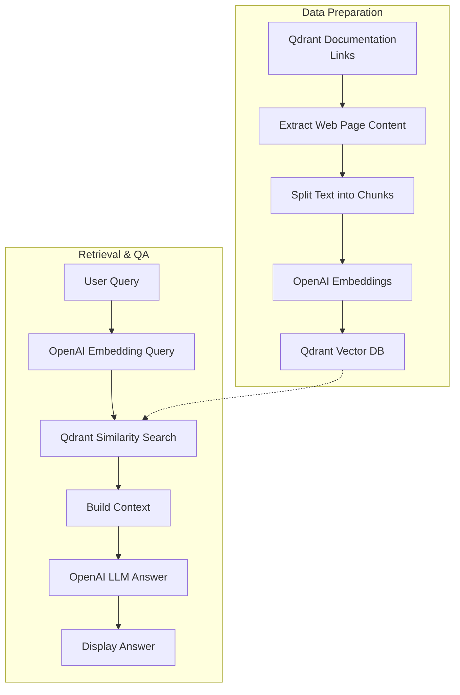

# Ask Your Websites with Qdrant

## Overview
This interactive notebook demonstrates how to build a Retrieval-Augmented Generation (RAG) pipeline using Qdrant as a vector database and LangChain for orchestration, with a focus on asking questions about the official Qdrant documentation. By providing links to selected Qdrant documentation pages, the notebook shows how to:

- **Extract and process website content:** Automatically fetch and parse web pages to obtain raw text data.
- **Chunk and embed text:** Split the extracted text into manageable chunks and generate vector embeddings using OpenAI or open-source models.
- **Store embeddings in Qdrant:** Persist the vectorized data in a local or remote Qdrant instance for efficient similarity search.
- **Retrieve relevant information:** Use semantic search to find the most relevant content chunks in response to user queries.
- **Build context and generate answers:** Assemble retrieved information into a coherent context and leverage an LLM to answer questions based on the ingested website data.

## workflow 

**Qdrant Documentation Links Used in This Notebook:**

- [Qdrant Homepage](http://qdrant.tech/?utm_medium=referral&utm_source=stars&utm_campaign=devrel&utm_content=mohammed-arbi)
- [Qdrant Documentation](https://qdrant.tech/documentation/?utm_medium=referral&utm_source=stars&utm_campaign=devrel&utm_content=mohammed-arbi)
- [Qdrant Cloud Signup](https://cloud.qdrant.io/signup?utm_medium=referral&utm_source=stars&utm_campaign=devrel&utm_content=mohammed-arbi)
- [FastEmbed Semantic Search](https://qdrant.tech/documentation/fastembed/fastembed-semantic-search/)
- [What is Vector Quantization?](https://qdrant.tech/articles/what-is-vector-quantization/)
- [Multiple Partitions Guide](https://qdrant.tech/documentation/guides/multiple-partitions/)

---

Contributions are welcome!
