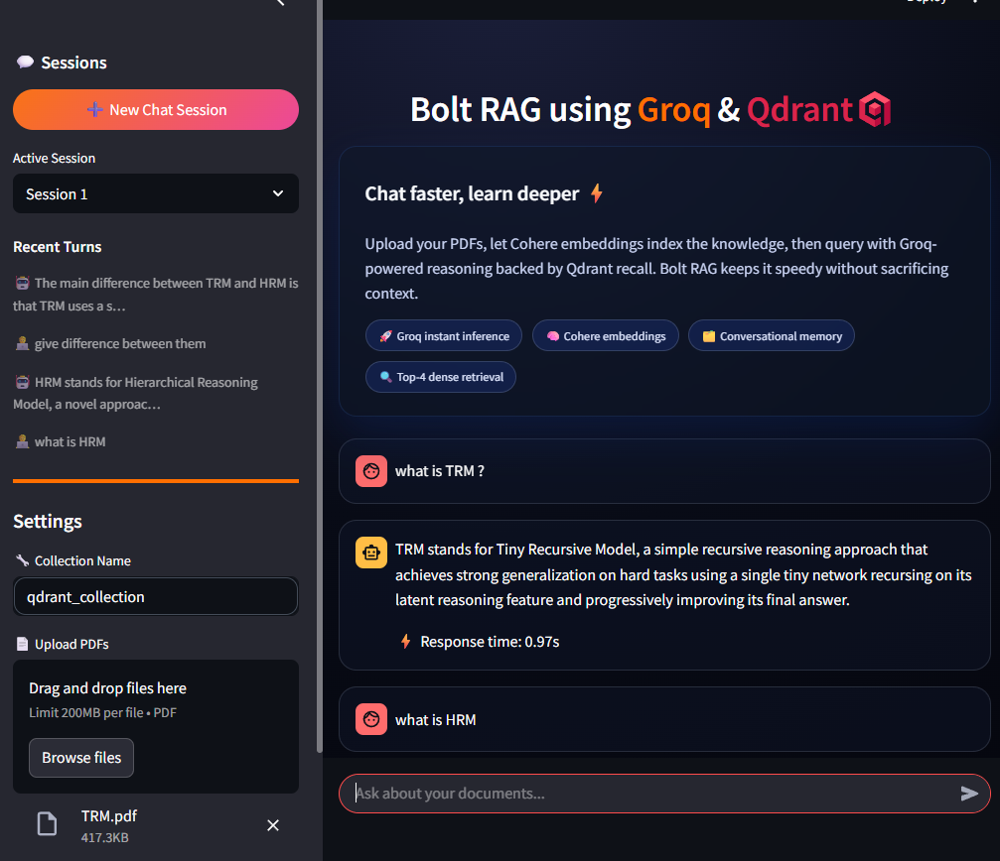
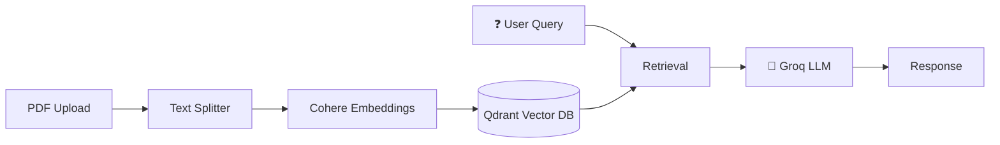

# Bolt RAG

Fast PDF chat with Groq + Qdrant vector storage.



## Quick Start

```bash
# Install dependencies
pip install -r requirements.txt

# Set up environment
# Create .env file with:
# COHERE_API_KEY=your_key_here
# GROQ_API_KEY=
# Run
streamlit run main.py
```

## Features

- Lightning-fast responses via Groq (Llama 3.1)
- Cohere embeddings for accurate retrieval
- Multi-session chat history
- PDF document processing
- 8-chunk context retrieval

## Architecture



- `main.py` - Application entry point
- `config.py` - Settings & configuration
- `models.py` - RAG processing logic
- `ui.py` - Streamlit UI components

## Usage

1. Upload PDF files via sidebar
2. Click "Process" to index documents
3. Ask questions about your documents
4. Switch between sessions to manage different contexts

## References

- [Qdrant Homepage](http://qdrant.tech/?utm_medium=referral&utm_source=stars&utm_campaign=devrel&utm_content=mohammed-arbi)
- [Qdrant Documentation](https://qdrant.tech/documentation/?utm_medium=referral&utm_source=stars&utm_campaign=devrel&utm_content=mohammed-arbi)
- [Qdrant Cloud Signup](https://cloud.qdrant.io/signup?utm_medium=referral&utm_source=stars&utm_campaign=devrel&utm_content=mohammed-arbi)
- [Cohere embeddings](https://docs.cohere.com/docs/embeddings)
