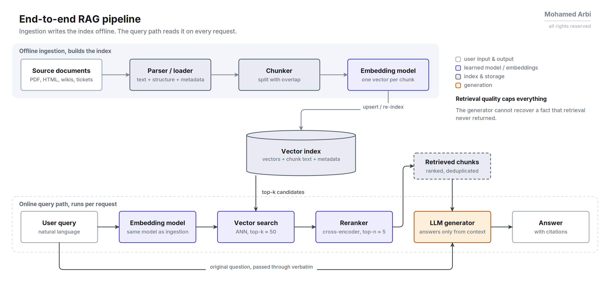
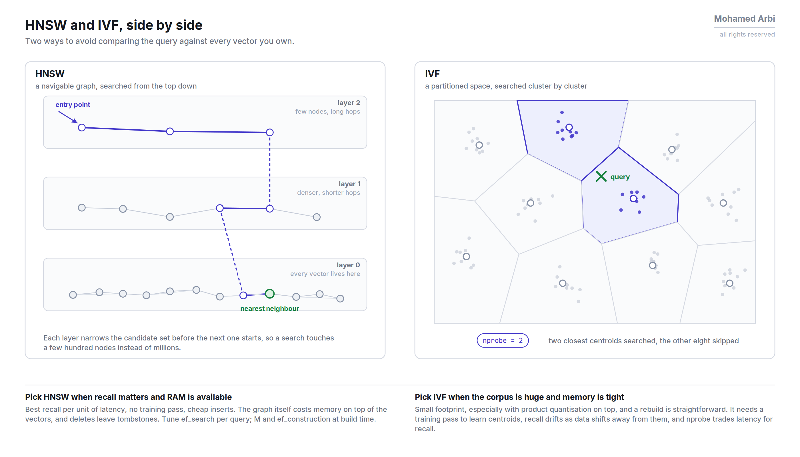
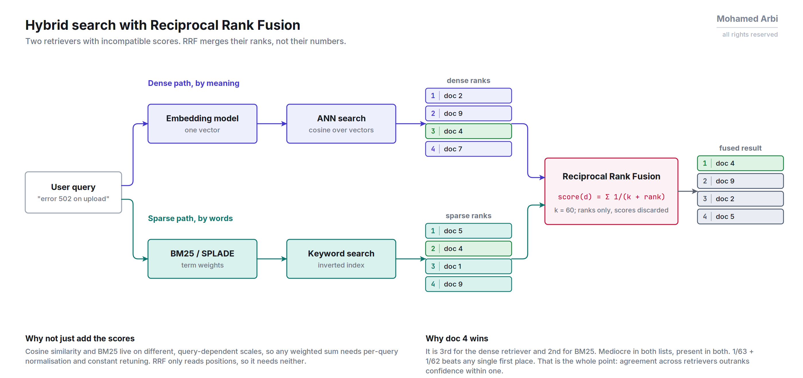
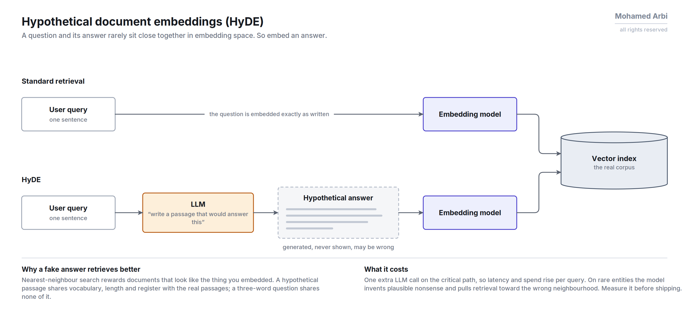
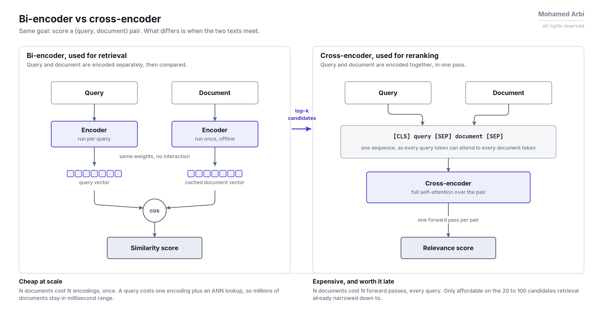
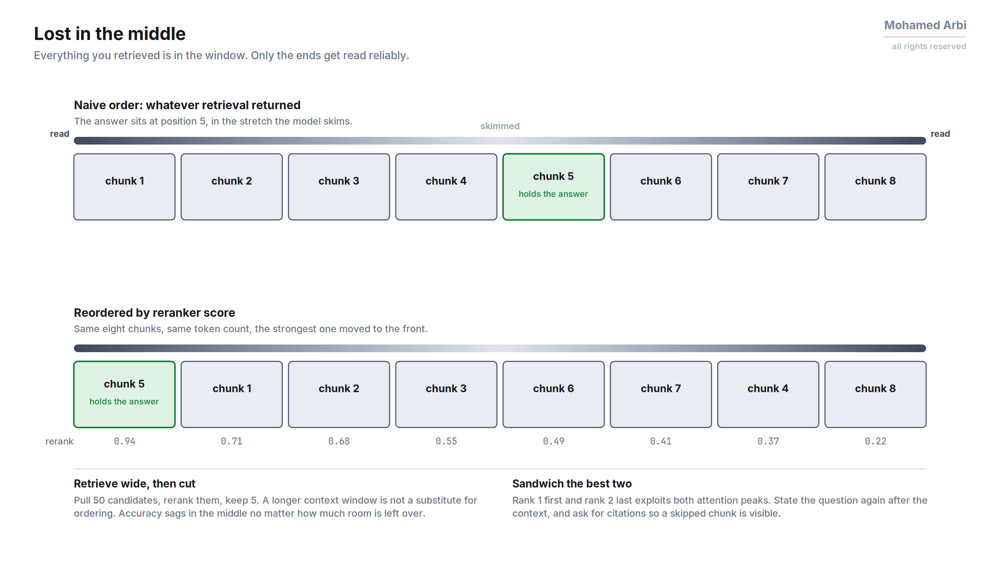

# RAG Interview Q&A by Pipeline Stage

Jump to: [Chunking & Ingestion](#chunking--ingestion) · [Embeddings](#embeddings) · [Indexing & Vector Search](#indexing--vector-search) · [Retrieval](#retrieval) · [Reranking](#reranking) · [Generation](#generation) · [Evaluation](#evaluation)

---

## Chunking & Ingestion

### 1. Why chunk documents at all instead of embedding whole documents?

Embedding models have a limited context window and lose precision over long inputs: a single vector for a 20-page doc averages out so much signal that retrieval can't distinguish it from other long docs. Chunking gives you units small enough to embed precisely and specific enough to retrieve accurately.

### 2. Fixed-size chunking vs semantic chunking: when does each fail?

| Approach | Strength | Failure mode |
|---|---|---|
| Fixed-size (e.g. 512 tokens, N overlap) | Cheap, deterministic | Slices mid-sentence or mid-table, splitting a fact from its context |
| Semantic (split on embedding-similarity breakpoints or structural boundaries) | Respects meaning | Slower to compute; can still separate a claim from a qualifier a few sentences later |

Neither solves long-range dependency loss. That's what contextual headers and parent-document retrieval are for.

### 3. What's the point of chunk overlap, and how do you pick the size?

Overlap prevents a fact that spans a chunk boundary from being unretrievable in either chunk. Typical overlap is 10-20% of chunk size. Too much overlap inflates the index and duplicates near-identical vectors, hurting retrieval diversity.

### 4. How do you chunk code or tables differently from prose?

- **Code**: chunk by function/class boundary (AST-aware), never mid-block. A split function loses the signature or the return statement.
- **Tables**: keep the header row attached to every chunk of body rows, or the retrieved chunk has numbers with no column labels.

---

## Embeddings

### 1. How do you choose an embedding model?

Weigh dimensionality (higher = more precision, more storage/compute), domain fit (general-purpose vs. code/legal/medical-tuned), context length, and whether it supports asymmetric encoding (separate query/passage encoders, which usually improves retrieval quality over symmetric models). Benchmark on your own labeled query-to-passage pairs, not just MTEB leaderboard rank: leaderboard-topping models can underperform on domain-specific jargon.

### 2. What's the difference between symmetric and asymmetric semantic search?

- **Symmetric**: query and document are similar in length/form (e.g. duplicate question detection). Same encoder, same distribution.
- **Asymmetric**: a short query vs. a long passage (classic RAG retrieval). A model trained for this, a dual-encoder with distinct query/passage prefixes, outperforms a general sentence-similarity model because its training objective matches the retrieval task.

### 3. Can you get away without re-embedding when you swap models?

No. Different models produce vectors in different, non-comparable spaces. Swapping embedding models means re-embedding the entire corpus and reindexing. For zero-downtime migration: write to a new collection with the new model, backfill, then cut over reads, dual-writing in the meantime.

---

## Indexing & Vector Search

### 1. HNSW vs IVF vs flat/brute-force: when does each make sense?

| Index | Behavior | Best for |
|---|---|---|
| Flat | Exact, no index build | Under ~100K vectors, or recall must be 100% |
| HNSW | Graph-based ANN, high recall/speed | Standard default (Qdrant, Weaviate, Pinecone); memory-hungry, slower to build/update |
| IVF (+PQ) | Clusters vectors, searches nearest clusters only | Billion-scale on constrained hardware; lower memory via quantization, moderate recall loss |

### 2. What does quantization cost you, and how do you know if it's safe?

Quantization (scalar/binary/product) shrinks vector storage and speeds up search by approximating the original vectors. The cost is recall: the approximation drops nearest neighbors that were only marginally closer than the ones that got kept.

It's safe when you rerank quantized-search candidates against the original full-precision vectors before returning results, or your recall@k tolerance has headroom (measure on a golden query set before/after).

### 3. How do you handle metadata filtering at scale (e.g. tenant isolation)?

- **Pre-filtering** (filter before ANN search): exact, but can break HNSW's graph structure if the filtered subset is tiny, forcing it to touch nearly the whole index.
- **Post-filtering** (ANN search then filter): fast, but can under-return if too many top-k results get filtered out.
- Purpose-built vector DBs (e.g. Qdrant) implement filtered HNSW that pushes the filter into graph traversal. Check whether yours does before assuming plain pre/post filtering.

---

## Retrieval

### 1. Why hybrid search (dense + sparse) instead of pure vector search?

Dense embeddings capture semantic similarity but miss exact-match signals (model names, part numbers, error codes, acronyms) where a user's literal keyword matters more than semantic neighborhood. Sparse (BM25/SPLADE) nails exact terms but misses paraphrase. Hybrid fuses both, commonly via Reciprocal Rank Fusion, to get both kinds of recall.

### 2. What is RRF, and why not just average the scores?

Reciprocal Rank Fusion combines ranked lists using `1/(k + rank)` per list, summed per document. It only needs rank position, not raw score. Dense cosine similarity and BM25 scores live on incompatible scales, so naively averaging raw scores is meaningless without careful normalization.

### 3. What's query expansion / HyDE, and when do you reach for it?

- **Query expansion**: rewrites or extends a short/ambiguous query using an LLM before embedding it. Useful when user queries are terse or use different vocabulary than the corpus.
- **HyDE** (Hypothetical Document Embeddings): has the LLM write a hypothetical answer to the query, then embeds *that* for retrieval, because a fabricated answer sits closer in embedding space to real answer passages than the bare question does.

Both cost one extra LLM call per query; use when recall on short queries is measurably weak.

### 4. How do you decide top-k?

Too low and you miss relevant context, especially for multi-hop questions needing several sources. Too high and you dilute the context window with irrelevant chunks (hurting generation quality, the "lost in the middle" effect) while raising token cost. Common approach: retrieve wide (e.g. k=50), rerank, then truncate to what actually fits (e.g. top 5).

---

## Reranking

### 1. Why rerank after retrieval instead of just retrieving more precisely up front?

Bi-encoders (used for fast ANN retrieval) embed query and document independently, so they can't model query-document interaction; they're built for speed at scale, not precision. Cross-encoders score a query-document pair jointly, which is far more accurate but too slow to run over the whole corpus.

Standard pattern: bi-encoder retrieves a wide candidate set, cross-encoder reranks the (small) candidate set for precision.

### 2. What's the latency/cost tradeoff of adding a reranker?

Adds one model call over up to k candidates (batched), typically tens to low hundreds of ms depending on model size and k. Justified when retrieval precision is the bottleneck on your eval: measure recall@k before and after reranking on a labeled set before adding the stage, don't add it reflexively.

---

## Generation

### 1. How do you reduce hallucination when the model has the right context but still gets it wrong?

Prompt the model to explicitly ground each claim in a cited chunk (cite-then-generate or generate-then-verify), lower temperature, and instruct it to say "not enough information" rather than guess. If it persists, the issue is often context ordering (relevant chunk buried in the middle) or contradictory chunks in context, not the prompt.

### 2. What is "lost in the middle," and how do you mitigate it?

LLMs attend more reliably to content near the start and end of the context window than to content in the middle, so a correct answer buried in chunk 15 of 20 gets under-weighted. Mitigate by placing the most relevant (post-rerank, highest-score) chunks at the start and/or end, not sorted by original document order.

### 3. When do you use a bigger model vs. more/better retrieval?

- Right answer **is** in the retrieved context, model still gets it wrong → generation/prompting problem. More retrieval won't fix it.
- Right answer **isn't** in the retrieved context → retrieval problem. No model size fixes that.

Diagnose by manually checking whether the golden passage was in the top-k before touching the LLM.

---

## Evaluation

### 1. What metrics do you actually track for a RAG system in production?

- **Retrieval**: recall@k, MRR, nDCG against a labeled query-to-relevant-doc set.
- **Generation**: faithfulness (is the answer supported by retrieved context, not just "correct" in the abstract), answer relevance, context precision/recall (RAGAS-style).
- **End-to-end**: task success rate on a held-out eval set, plus latency and cost per query.

### 2. How do you build a golden eval set when you don't have labeled data?

Generate synthetic query-answer-source-chunk triples with an LLM from your corpus, then have a human spot-check a sample for quality. Supplement with real user queries and logged "was this helpful" signal once in production. A golden set under ~50 examples is too noisy to trust deltas from; aim for a few hundred covering your actual query distribution (easy/hard, short/multi-hop).

### 3. LLM-as-judge: what are the failure modes?

- **Position bias**: favors the first answer shown in pairwise comparison.
- **Verbosity bias**: favors longer answers regardless of correctness.
- **Self-preference**: a model judges its own family's outputs more favorably.

Mitigate with randomized answer order, an explicit rubric instead of open-ended "which is better," and periodic human-audited spot checks against the judge's verdicts.
