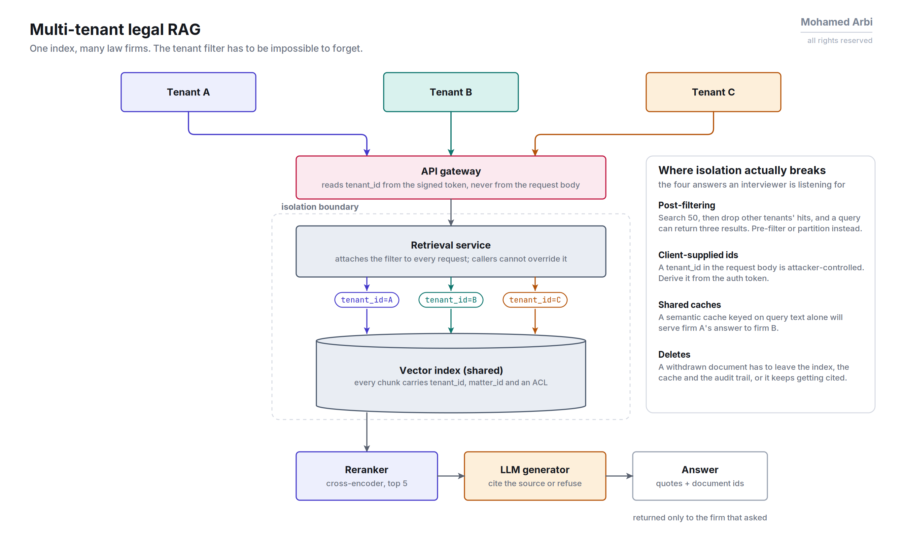
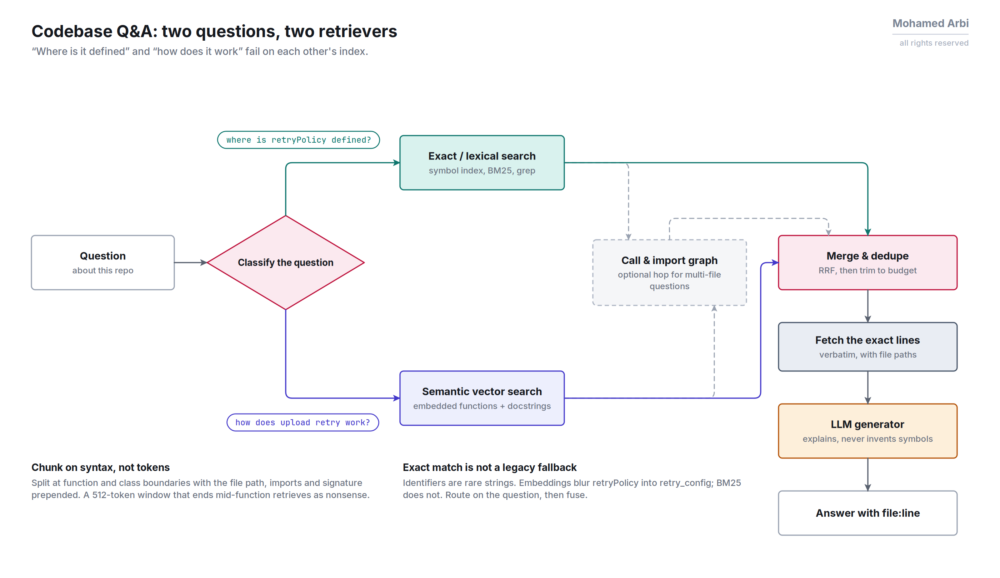
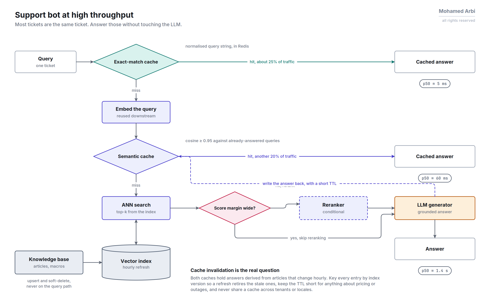
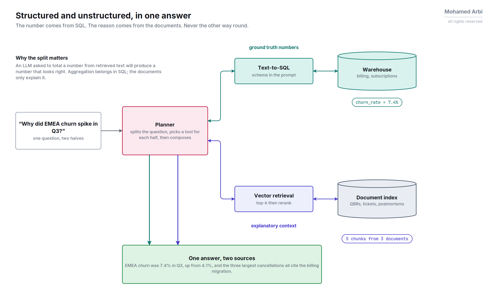

# RAG System Design Scenarios

Whiteboard-style prompts. Try sketching the architecture and talking through tradeoffs out loud before reading the answer sketch, that's the actual interview skill being tested, not the "right" answer.

---

## 1. Design RAG over 10M legal/contract PDFs, multi-tenant, strict data isolation

**Constraints to surface**: tenants must never see each other's documents even via retrieval leakage; documents are long, structured (clauses, definitions, cross-references); legal answers need citations, not paraphrase.

**Answer sketch**:
- Ingestion: layout-aware PDF parsing (preserve clause numbering/structure) → chunk per clause/section, not fixed token windows. A contract clause split mid-way is worse than useless.
- Store `tenant_id` as an indexed, mandatory filter field on every vector. Enforce it in the retrieval layer, not just the application layer, so a bug upstream can't leak across tenants. Prefer a vector DB with native filtered search over doing the filter in application code after fetch.
- Hybrid retrieval (dense + BM25): legal text has exact defined terms ("the Agreement", clause numbers) that dense-only search under-retrieves.
- Reranker before generation: precision matters more than recall here; a wrong contract clause cited is a liability, not just a bad answer.
- Generation: forced citation format (chunk id / clause number) so answers are auditable; refuse to answer when the reranked top result is below a confidence threshold rather than guessing.
- Isolation options beyond metadata filtering: per-tenant collections (stronger isolation, worse resource sharing at scale) vs. shared collection with filter (cheaper, requires the filter guarantee above). Pick based on tenant count and compliance requirements (some clients may contractually require physical isolation).

---

## 2. Design RAG for a codebase Q&A assistant (internal dev tool)

**Constraints to surface**: code has structure (functions, imports, call graphs) that plain text doesn't; queries range from "where is X defined" (exact/lexical) to "how does auth flow work" (semantic, multi-file); codebase changes constantly (needs incremental indexing).

**Answer sketch**:
- Chunk by AST unit (function/class), not line-window. Attach the enclosing file path, imports, and docstring as chunk metadata/header so a retrieved function snippet is self-contained.
- Two retrieval paths, not one: lexical/exact search (grep-like, or BM25) for "where is X defined" style queries, and semantic vector search for "how does X work" style queries. Route by query classification, or just run both and fuse (RRF).
- Incremental indexing keyed on file hash: re-embed only changed files on commit/webhook, not full reindex; stale chunks from deleted/renamed files must be pruned or they surface dead code as if current.
- For "how does X work" multi-file questions, single-chunk retrieval isn't enough. Consider a call-graph or import-graph traversal step (graph RAG) to pull in related files, not just top-k similar text.
- Generation: model needs the actual retrieved code verbatim in context (not summarized) since developers will copy-paste it. Keep formatting/whitespace intact through the pipeline.

---

## 3. Design RAG for a customer support bot at 10K queries/sec

**Constraints to surface**: latency budget is tight (users won't wait), most queries repeat or are near-duplicates, knowledge base updates hourly (new articles/policies), cost per query matters at this volume.

**Answer sketch**:
- Cache aggressively: exact-match query cache first (cheap win for literal repeats), then semantic cache (embed query, check for a near-duplicate previously-answered query above a similarity threshold) before running the full pipeline.
- Precompute/pre-embed the knowledge base offline; only the query gets embedded at request time. Keep the online path to one embedding call plus one ANN search plus rerank plus generation, nothing else synchronous.
- Use a smaller/faster embedding model and a lightweight reranker (or skip reranking for high-confidence top-1 hits, only rerank when top results are close in score) to hit latency budget. Decide the precision/latency tradeoff by measuring on your eval set, not by default.
- Knowledge base updates: append-new / soft-delete-old rather than full reindex; vector DBs that support live upserts (no downtime reindex) are a hard requirement here.
- Fallback path: if retrieval confidence is low, hand off to a human agent rather than generating a low-confidence answer. Support contexts have a real cost to a wrong answer (policy/refund questions).
- At this scale, horizontal sharding of the vector index (by topic/product line, or hash-based) is likely needed; single-node HNSW may not hold the full corpus with acceptable query latency.

---

## 4. Design RAG that combines structured (SQL/tables) and unstructured (docs) data

**Constraints to surface**: some questions need exact aggregation ("total revenue last quarter," which must come from a real query, not a retrieved paragraph); some need document context ("why did revenue drop"); many need both.

**Answer sketch**:
- Don't force everything through vector retrieval. Route by query type: a query classifier (or the LLM itself, via a tool-calling/agentic step) decides text-to-SQL against the structured store for aggregation/lookup questions, vector retrieval for narrative/explanatory questions, or both when the question needs them (e.g. "why did revenue drop" → SQL for the number, doc retrieval for the narrative explanation, then synthesize).
- Never let the LLM approximate a number from a retrieved doc snippet when a ground-truth structured source exists. That's a correctness regression versus just querying the database directly.
- This is effectively agentic RAG (LLM decides which tool/retriever to invoke) rather than a single fixed retrieval pipeline. Surface that framing explicitly, it's usually what the interviewer is probing for.

---

## Tips for the whiteboard round

- State assumptions out loud before designing ("I'm assuming query volume is X, corpus is Y size, latency budget is Z"). Designs are graded on this reasoning, not just the final diagram.
- Always mention the eval loop. A design with no mention of how you'd measure retrieval/generation quality reads as incomplete.
- Say where you'd cut corners for v1 vs. what you'd add for scale/production hardening. Shows you can prioritize, not just list every technique you know.
